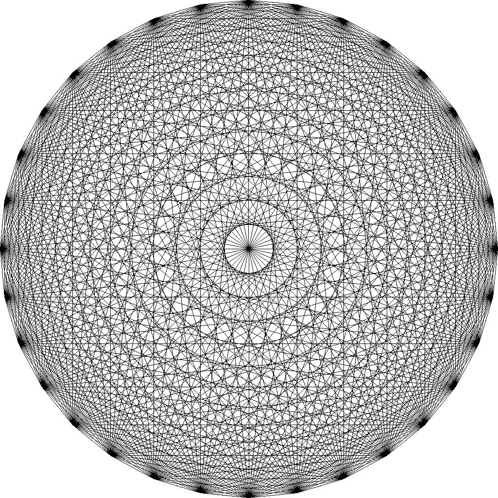

# Figure

| | |
|:-----------:|:------------:|
| 動作環境 operating environment | python3.x |
| 必要モジュール required python module | pillow (to run Gallery.py) |

点、線分、多角形、フラクタルなどの図形をpythonで扱うためのクラス(Figure.py)とその使用例(Gallery.py)です。

python class for figures such as point, line, polygon, fractal etc. (Figure.py) and its simple usage (Gallery.py).

`python Gallery.py`を実行すると./Galleryフォルダ内にいくつかの画像が保存されます。実行にはpillowというpythonモジュールが必要です。

`python Gallery.py` generates sample pictures in ./Gallery directry. Python module pillow is required to generate the images.

