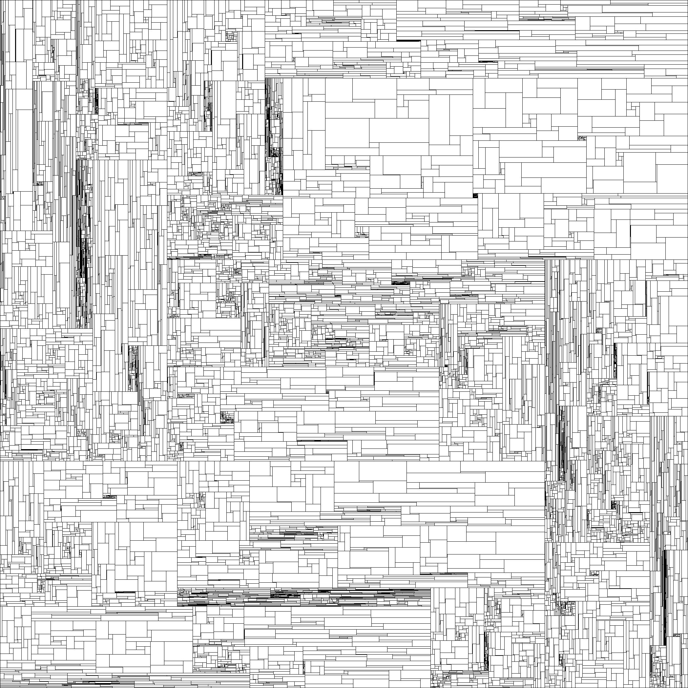
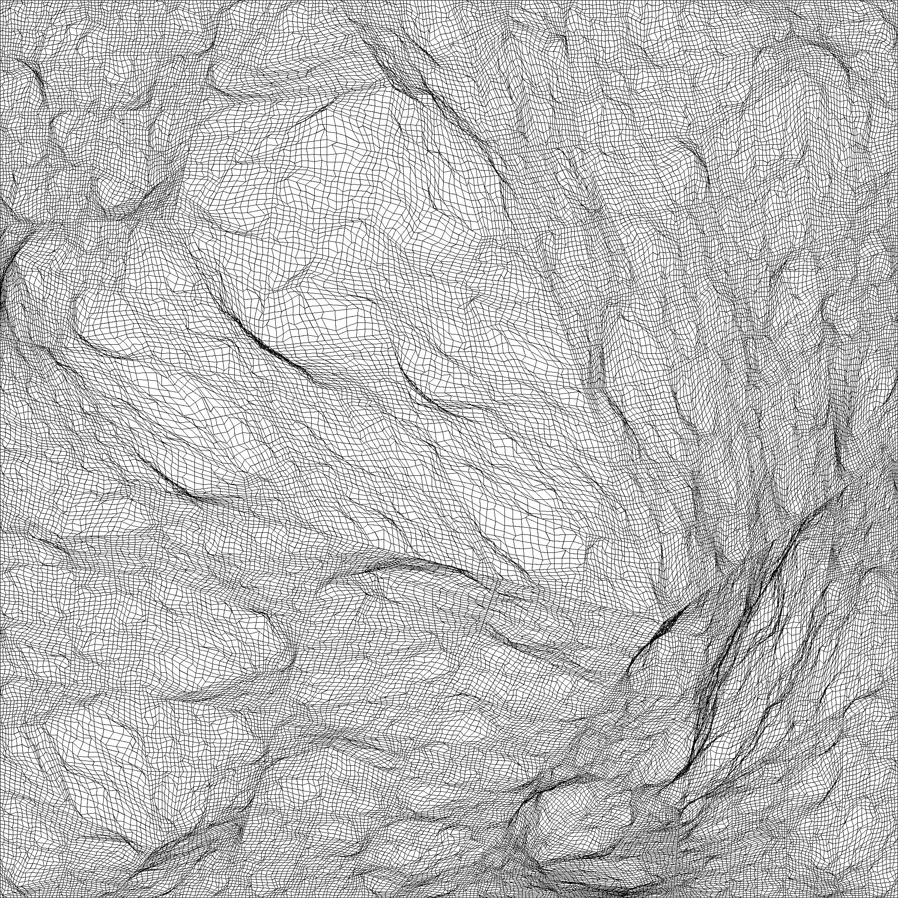

# Figure

| | |
|:-----------:|:------------:|
| 動作環境 | python3.x |
| 必要モジュール | pillow (画像をjpgで保存するときに必要) |


点、線分、多角形、フラクタルなどの図形をpythonで扱うためのクラスとその使用例です。

以下のコマンドで図形のビューアが起動します。スクロールバーから図形を選んで"reload"ボタンを押すと選択した図形が描画されます。また"save"ボタンで見ている図形をjpg画像として保存できます。

```python
python FigureViewer2D.py
```

図形はpythonのソースコードで作られているので、テキストエディタで編集することができます。編集した後に"reload"ボタンを押せば変更が読み込まれます。


以下はビューアで見られる図形の画像です。どの図形も20行程度のプログラムで作られています。

||||
|---|---|---|
||||
||||
||||
||||
||||
||||
||||
||||
||||
